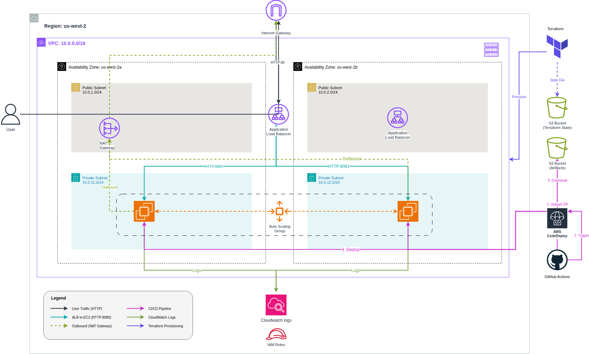

# AWS EC2 Auto Scaling with CodeDeploy

Production-ready infrastructure for deploying Node.js applications on AWS EC2 with automated scaling and continuous deployment.

## Architecture



## Overview

- **Infrastructure**: Terraform-managed VPC, ALB, Auto Scaling Group, CodeDeploy
- **Deployment**: GitHub Actions → S3 → CodeDeploy → EC2
- **Scaling**: Target tracking based on CPU utilization (50%)
- **Authentication**: OIDC (no stored AWS credentials)

## Prerequisites

- AWS account with administrative access
- Terraform >= 1.0
- AWS CLI configured
- GitHub repository with Actions enabled
- Node.js application listening on port 8080
- S3 bucket + DynamoDB table for Terraform backend

## Important Files

**Terraform Infrastructure:**
- `main.tf` - Root module orchestration
- `variables.tf` - Variable definitions
- `terraform.tfvars` - Configuration values
- `modules/` - VPC, Security, ALB, IAM, EC2, CodeDeploy

**Application Repository:**
- `appspec.yml` - CodeDeploy configuration (at repo root)
- `scripts/setup.sh` - EC2 user data (host preparation only)
- `codedeploy/scripts/before_install.sh` - Cleanup hook
- `codedeploy/scripts/install_deps.sh` - npm install hook
- `codedeploy/scripts/start_server.sh` - PM2 start hook
- `codedeploy/scripts/validate_service.sh` - Health check hook
- `.github/workflows/deploy.yml` - CI/CD pipeline

## Quick Start

### 1. Deploy Infrastructure

```bash
terraform init
terraform validate
terraform plan
terraform apply
```

### 2. Configure GitHub

**Repository Secrets:**
- `AWS_ROLE_ARN` - From `terraform output github_actions_role_arn`

**Repository Variables:**
- `AWS_REGION` - us-west-2
- `CODEDEPLOY_APP` - From `terraform output codedeploy_app_name`
- `CODEDEPLOY_GROUP` - From `terraform output deployment_group_name`
- `S3_BUCKET` - From `terraform output deployment_bucket_name`

### 3. Deploy Application

Trigger GitHub Actions workflow manually or push to main branch.

### 4. Access Application

```bash
# Get ALB DNS name
terraform output alb_dns_name

# Access in browser
http://<alb-dns-name>
```

## Deployment Workflow

1. **Infrastructure Provisioning**: Terraform creates VPC, subnets, ALB, ASG, CodeDeploy
2. **EC2 Bootstrap**: User data installs Node.js, PM2, CodeDeploy agent (no app deployment)
3. **First Deployment**: GitHub Actions → S3 → CodeDeploy deploys application
4. **Updates**: Same pipeline updates existing instances via rolling deployment

## Important Notes

- **User data does NOT deploy the application** - only prepares the host
- **CodeDeploy owns application lifecycle** - initial and all subsequent deployments
- **All hooks run as root** to avoid permission conflicts
- **Application must listen on port 8080**

## Monitoring

- **CloudWatch Logs**: `/aws/ec2/wu-node-app`
- **Target Health**: EC2 Console → Target Groups → wu-node-app-tg
- **Deployments**: CodeDeploy Console → Deployments

## Cost Estimate

~$50-70/month (2x t3.micro, NAT Gateway, ALB, data transfer)

## Cleanup

```bash
terraform destroy
```

---

**Tech Stack**: Terraform | AWS (EC2, ALB, ASG, CodeDeploy, S3) | GitHub Actions | Node.js | PM2
